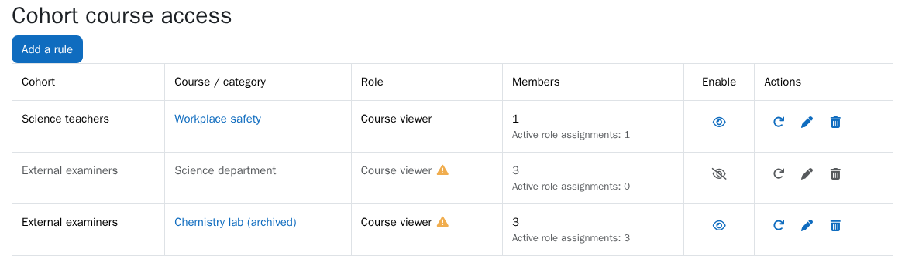
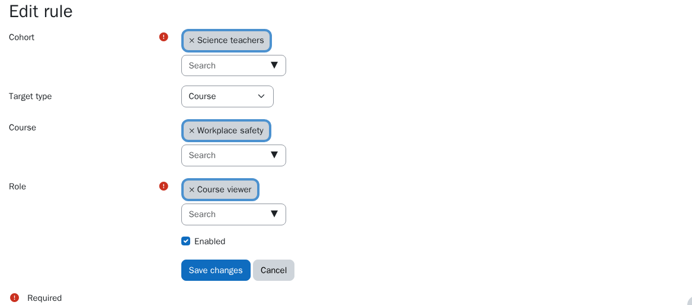

# Cohort course access (`local_cohortaccess`)

[](https://github.com/CEPV-Vevey/moodle-local_cohortaccess/actions/workflows/ci.yml)
[](https://github.com/CEPV-Vevey/moodle-local_cohortaccess/releases)

[](https://www.gnu.org/licenses/gpl-3.0.html)

A Moodle local plugin that gives the members of a cohort **view access** to a
course, or to every course of a category, **without enrolling them**.

The plugin assigns a role (`role_assignments`) to the cohort members in the
course or category context and keeps it in sync with the cohort. It never
creates enrolments (`user_enrolments`).



## Contents

- [Why this plugin](#why-this-plugin)
- [Requirements](#requirements)
- [Installation](#installation)
- [Setting up the role](#setting-up-the-role)
- [Usage](#usage)
- [How it works](#how-it-works)
- [Limitations ("viewing" access)](#limitations-viewing-access)
- [Troubleshooting / FAQ](#troubleshooting--faq)
- [Capabilities](#capabilities)
- [Security](#security)
- [Privacy](#privacy)
- [Uninstalling](#uninstalling)
- [Development](#development)
- [Support and contributing](#support-and-contributing)
- [Credits and license](#credits-and-license)

## Why this plugin

Typical use: let colleagues, mentors, inspectors or examiners browse course
content without turning them into participants (no gradebook entry, no
activity completion, not counted in course reports).

| | Gives access to courses | Enrols users | Context |
|---|---|---|---|
| Core **Cohort sync** (`enrol_cohort`) | Yes | **Yes**: users become participants, appear in the gradebook and reports | One course per instance |
| [**Cohort role synchronization**](https://moodle.org/plugins/local_cohortrole) (`local_cohortrole`) | Only through system-level capabilities | No | **System only** |
| **Cohort course access** (this plugin) | Yes, view access | **No** | **Course or course category** (inherited by all its courses) |

## Requirements

- Moodle 5.0 or later (tested on 5.0 and 5.1, with PostgreSQL and MariaDB).
- A role allowed to view courses without enrolment (see
  [Setting up the role](#setting-up-the-role)).

## Installation

1. Download `local_cohortaccess-<version>.zip` from the
   [releases page](https://github.com/CEPV-Vevey/moodle-local_cohortaccess/releases).
2. Install it with *Site administration → Plugins → Install plugins*, or unzip it
   into `local/` (`public/local/` on Moodle 5.1+) so that the plugin ends up in
   `local/cohortaccess`. You can also clone this repository into
   `local/cohortaccess`.
3. Visit *Site administration → Notifications* (or run
   `php admin/cli/upgrade.php`).

To upgrade, install the newer zip over the existing plugin. Rules are kept.

## Setting up the role

Use a dedicated role (for example "Course viewer"), or an existing one that
fits. In *Site administration → Users → Permissions → Define roles*:

1. **Context types where this role may be assigned**: tick **Course** and
   **Category**. Other roles are not offered in the rule form.
2. **`moodle/course:view` = Allow**: **required**. This is what lets a user
   enter a course without being enrolled.
3. **`moodle/course:viewhiddencourses` = Allow**: only if target courses may be
   hidden.
4. **Allow role assignments**: whoever creates rules must be allowed to assign
   the role in the target course or category. Site administrators always can.

The plugin never changes role definitions. It shows a ⚠ warning when the
chosen role lacks `moodle/course:view` (or `viewhiddencourses` when the target
is a hidden course or a category containing hidden courses).

> **Warning: a rule grants every capability of the role, not just viewing.**
> The role is assigned in the whole course, or in every course of the category.
> If the role has teacher-like capabilities, such as seeing participants
> (`moodle/course:viewparticipants`), viewing grades (`moodle/grade:viewall`),
> viewing reports or editing the course, cohort members get them wherever the
> rule applies. For view-only access, the role should only contain
> `moodle/course:view` (and `viewhiddencourses` if needed).

## Usage

Open *Site administration → Users → Accounts → Cohort course access* (right
below *Cohorts*).



1. **Add a rule**: choose the cohort (system or category cohort), the target (a
   course or a course category) and the role. Saving creates the role
   assignments at once.
2. The list shows, for each rule, the number of cohort members and of active
   role assignments, and a ⚠ next to the role or the target when the role lacks
   a capability or the target no longer exists.
3. Actions, as in Moodle core management tables:
   - eye icon: **disable** (open eye) or **enable** (slashed eye) the rule;
     disabled rules are greyed out and their assignments are removed;
   - **synchronise**: recompute the rule's assignments now;
   - **edit**: change cohort, target or role (old assignments are replaced);
   - **delete**: remove the rule and all its assignments (with confirmation).

Members then open the course with its direct link (`/course/view.php?id=…`) or
by browsing the category.

## How it works

- Creating or enabling a rule assigns the role to every cohort member in the
  target context. Disabling or deleting it removes those assignments.
- Users joining or leaving the cohort get or lose the role immediately (event
  observers).
- Editing a rule replaces the old assignments (old role or target) with new
  ones.
- Deleting a cohort, course, category or role deletes the rules using it,
  together with their assignments.
- A scheduled task (`\local_cohortaccess\task\sync`, hourly) resynchronises all
  rules and repairs any drift, including assignments left by deleted rules.
  Run it manually with
  `php admin/cli/scheduled_task.php --execute='\local_cohortaccess\task\sync'`.

Every role assignment created by the plugin has
`component = local_cohortaccess` and `itemid = <rule id>`. The plugin **never**
removes a manual role assignment or one created by another plugin. When two
rules grant the same access, deleting one of them keeps the access granted by
the other.

## Limitations ("viewing" access)

Users are not enrolled, so Moodle treats them as viewers (`is_viewing()`):

- They can see the course content (pages, files, resources).
- They cannot take part in activities that require enrolment (quizzes,
  assignments, etc.).
- They are not in the gradebook nor in the participants list (they appear under
  *Participants → Other users*).
- The course does not show up in "My courses" or on the dashboard.

## Troubleshooting / FAQ

**A member still lands on the "Enrolment options" page.**
Open the course itself (`/course/view.php?id=…`). The enrolment options page
(`/enrol/index.php?id=…`) only sends *enrolled* users back to the course: a user
who was redirected there while they had no access, and who just reloads it once
access is granted, keeps seeing the enrolment options. This is Moodle core
behaviour.

**A member has no access at all.**
In the course, open *Participants → Other users*: the member should be listed
with the rule's role. Then use *Check permissions* (`/admin/roles/check.php`) on
the course for that user: `moodle/course:view` must be *Yes*. If it is *No*, a
permission override in the course or a parent category (or a *Prohibit* in
another role of the user) cancels it.

**The course is missing from "My courses".**
Expected: "My courses" lists enrolments only. Share the course link instead.

**A member is also enrolled in the course and lost access for a while.**
When a user loses their last enrolment in a course, Moodle core removes all
their role assignments there, the plugin's included. The hourly task restores
it; you can also click *Synchronise* on the rule.

**Large cohorts.**
Saving a rule synchronises it during the request. For cohorts of several
thousand users this may take a while; the scheduled task completes any
interrupted synchronisation.

## Capabilities

| Capability | Context | Default | Allows |
|---|---|---|---|
| `local/cohortaccess:manage` | System | Manager | Listing, creating, editing, enabling/disabling, synchronising and deleting rules |

## Security

- Rule management requires `local/cohortaccess:manage`, flagged with the
  configuration, personal data, XSS and spam risks since it lets its holder
  grant roles.
- A rule can only use a role the current user is allowed to assign in the
  target course or category (`get_assignable_roles()`), so delegating the
  capability does not let anyone escalate their privileges.
- Every state-changing action checks the session key; deletion asks for
  confirmation.
- Removals are always scoped to `component = local_cohortaccess` and the rule
  id: manual role assignments and those of other plugins are never touched.

## Privacy

The plugin stores no personal data: rules only reference cohorts, roles,
courses and categories. The role assignments it creates are core data, stored,
exported and deleted by Moodle's role subsystem (privacy API `null_provider`).

## Uninstalling

Uninstalling removes every role assignment created by the plugin. Manual role
assignments are kept.

## Development

PHPUnit:

```
php admin/tool/phpunit/cli/init.php
vendor/bin/phpunit --testsuite local_cohortaccess_testsuite
```

GitHub Actions runs moodle-plugin-ci (phplint, phpcs, phpdoc, validate,
savepoints, mustache, phpunit) on Moodle 5.0 and 5.1.

Releasing: bump `$plugin->version` and `$plugin->release` in `version.php`,
update [CHANGES.md](CHANGES.md), commit, then push a matching tag
(`release = '0.3.0'` → tag `v0.3.0`). The release workflow checks the tag, runs
the CI, builds the installable zip and attaches it to a GitHub release.

For local web testing, do not install the plugin through a symbolic link (pages
use `__DIR__ . '/../../config.php'`); copy it or use a bind mount.

## Support and contributing

Bug reports and feature requests:
[GitHub issues](https://github.com/CEPV-Vevey/moodle-local_cohortaccess/issues).
Pull requests are welcome; please keep the CI green and add PHPUnit tests for
behaviour changes.

See [CHANGES.md](CHANGES.md) for the release history.

## Credits and license

Developed by Yann Rapenne for the CEPV.

GNU GPL v3 or later. See <https://www.gnu.org/licenses/gpl-3.0.html>.
